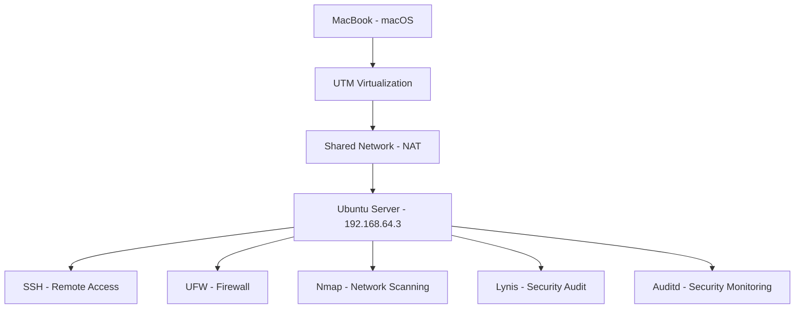

# Homelab Network Diagram

This diagram shows my cybersecurity homelab architecture.

```mermaid
flowchart TD
    A["MacBook - macOS"] --> B["UTM Virtualization"]
    B --> C["Shared Network - NAT"]
    C --> D["Ubuntu Server - 192.168.64.3"]
    D --> E["SSH - Remote Access"]
    D --> F["UFW - Firewall"]
    D --> G["Nmap - Network Scanning"]
    D --> H["Lynis - Security Audit"]
    D --> I["Auditd - Security Monitoring"]
```
